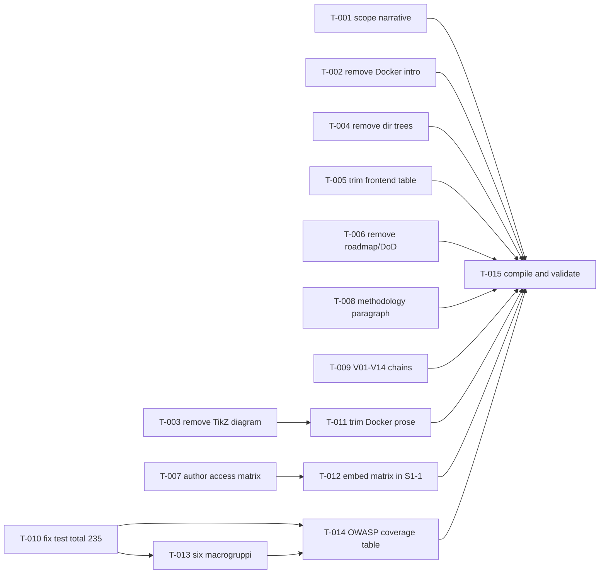

# Build Site — ExtendRent Security Report (main.tex) Revision

Source document: `/home/emanuele/IdeaProjects/TEXT_PROG/main.tex`
All tasks edit the LaTeX source only. No code changes.

---

## Tier 0 — No Dependencies (Start Here)

| T-ID  | Title                                                         | Kit Requirement                        | Effort | blockedBy |
|-------|---------------------------------------------------------------|----------------------------------------|--------|-----------|
| T-001 | Rewrite project scope narrative (5-10 lines, four phases)     | cavekit-scope/R1                       | S      | none      |
| T-002 | Remove Docker "Introduzione" subsection                       | cavekit-cleanup/R1                     | S      | none      |
| T-003 | Remove TikZ architecture diagram and browser-flow paragraph   | cavekit-cleanup/R2                     | S      | none      |
| T-004 | Remove backend and frontend directory tree lstlistings        | cavekit-cleanup/R3                     | S      | none      |
| T-005 | Trim frontend technology table to <=9 allowed rows            | cavekit-cleanup/R4                     | S      | none      |
| T-006 | Remove Roadmap, DoD, Metriche Target subsections              | cavekit-cleanup/R5                     | S      | none      |
| T-007 | Author the access control matrix LaTeX table                  | cavekit-access-matrix/R1               | M      | none      |
| T-008 | Add credible vulnerability methodology paragraph              | cavekit-vulnerability-methodology/R1   | S      | none      |
| T-009 | Rewrite V01-V14 cause-fix-test chains, purge "regression"     | cavekit-vulnerability-methodology/R2   | L      | none      |
| T-010 | Fix test total to 235 (intro, stats table, conclusions)       | cavekit-tests/R1                       | S      | none      |

## Tier 1 — Depends on Tier 0

| T-ID  | Title                                                         | Kit Requirement                        | Effort | blockedBy         |
|-------|---------------------------------------------------------------|----------------------------------------|--------|-------------------|
| T-011 | Remove verbose Docker explanations; keep table:docker-choices | cavekit-cleanup/R6                     | M      | T-003             |
| T-012 | Embed access matrix in S1-1 subsection with framing paragraph | cavekit-access-matrix/R2               | S      | T-007             |
| T-013 | Reorganize test section into 6 macrogruppi (235 total)        | cavekit-tests/R2                       | L      | T-010             |

## Tier 2 — Depends on Tier 1

| T-ID  | Title                                                         | Kit Requirement                        | Effort | blockedBy         |
|-------|---------------------------------------------------------------|----------------------------------------|--------|-------------------|
| T-014 | Update OWASP coverage table to 235 with per-category counts   | cavekit-tests/R3                       | S      | T-010, T-013      |

## Tier 3 — Final Validation

| T-ID  | Title                                                         | Kit Requirement                        | Effort | blockedBy                                           |
|-------|---------------------------------------------------------------|----------------------------------------|--------|-----------------------------------------------------|
| T-015 | Compile main.tex, resolve broken refs, verify no orphan labels | all                                   | S      | T-001..T-014                                        |

---

## Summary

- Total tasks: 15
- Tier 0 (parallel-ready): 10
- Tier 1: 3
- Tier 2: 1
- Tier 3 (compile gate): 1
- All 18 cavekit requirements covered. All 68 acceptance criteria mapped.
- No orphan tasks. No cycles.

---

## Coverage Matrix

Every acceptance criterion (AC) maps to at least one task. Criteria are numbered in the order they appear in the kit.

### cavekit-scope.md

| Req | AC # | Criterion (abbrev)                                                       | Task(s) |
|-----|------|--------------------------------------------------------------------------|---------|
| R1  | 1    | No reference to course objectives/modules/learning outcomes              | T-001   |
| R1  | 2    | Mentions ExtendRent by name as existing open-source application          | T-001   |
| R1  | 3    | Lists four phases in order: analysis, patch, test, containerization      | T-001   |
| R1  | 4    | If OWASP mentioned, only for classification after vuln identification    | T-001   |
| R1  | 5    | Section body between 5 and 10 lines                                      | T-001   |

### cavekit-cleanup.md

| Req | AC # | Criterion (abbrev)                                                       | Task(s)       |
|-----|------|--------------------------------------------------------------------------|---------------|
| R1  | 1    | No "Introduzione" subsection in Docker section                           | T-002         |
| R1  | 2    | First Docker subsection is project-specific                              | T-002         |
| R1  | 3    | No paragraph defining containers / Docker Hub                            | T-002         |
| R2  | 1    | No `tikzpicture` in Docker section                                       | T-003         |
| R2  | 2    | Label `fig:docker-arch` absent; no `\ref`/`\autoref` to it               | T-003, T-015  |
| R2  | 3    | Browser->nginx->Spring Boot->PostgreSQL paragraph removed                | T-003         |
| R2  | 4    | Surrounding text grammatically coherent                                  | T-003         |
| R3  | 1    | No `lstlisting` directory tree for `rentACar_backend/`                   | T-004         |
| R3  | 2    | No `lstlisting` directory tree for `rent-a-car-frontend-project/src/`   | T-004         |
| R3  | 3    | No "Struttura delle directory del progetto" / "Struttura semplificata del frontend" captions | T-004 |
| R3  | 4    | Paragraphs before/after removed listings grammatical                     | T-004         |
| R4  | 1    | Frontend stack table has <=9 data rows                                   | T-005         |
| R4  | 2    | No `material-react-table` row                                            | T-005         |
| R4  | 3    | No decorative/animation library rows                                     | T-005         |
| R4  | 4    | Rows preserved: React+TS, React Router, Redux Toolkit, Axios, Formik+Yup, jwt-decode | T-005 |
| R5  | 1    | No "Raccomandazioni Finali e Roadmap" subsection                         | T-006         |
| R5  | 2    | No future-phases/target-dates table                                      | T-006         |
| R5  | 3    | No "Definition of Done" checklist                                        | T-006         |
| R5  | 4    | No "Metriche Target" table                                               | T-006         |
| R5  | 5    | Security Tests section ends with OWASP/CWE mapping or stats table        | T-006, T-014  |
| R6  | 1    | No paragraph on `daemon off;` / nginx PID 1                              | T-011         |
| R6  | 2    | No paragraph/bullet on `--no-install-recommends` / layer sizing          | T-011         |
| R6  | 3    | `\subsection{Architettura Risultante}` removed                           | T-011         |
| R6  | 4    | `table:docker-choices` still present                                     | T-011         |
| R6  | 5    | Remaining Docker section covers Dockerfile stages, nginx config, docker-compose, secrets | T-011 |

### cavekit-access-matrix.md

| Req | AC # | Criterion (abbrev)                                                       | Task(s)       |
|-----|------|--------------------------------------------------------------------------|---------------|
| R1  | 1    | Every endpoint group from three-tier partition in matrix                 | T-007         |
| R1  | 2    | Public rows: 200 for all four roles                                      | T-007         |
| R1  | 3    | Authenticated rows: 401 Anon, 200 CUSTOMER/EMPLOYEE/ADMIN                | T-007         |
| R1  | 4    | ADMIN-only rows: 401 Anon, 403 CUSTOMER/EMPLOYEE, 200 ADMIN              | T-007         |
| R1  | 5    | Single column per role, single row per group, header names four roles    | T-007         |
| R1  | 6    | Table renders without overflow, consistent formatting                    | T-007, T-015  |
| R2  | 1    | Matrix inside `\subsection{S1-1 — Implementazione del Deny-by-Default RBAC}` | T-012     |
| R2  | 2    | Preceding paragraph describes pre-patch permitAll and post-patch deny-by-default | T-012 |
| R2  | 3    | Preceding paragraph is 2-3 sentences                                     | T-012         |
| R2  | 4    | Caption references access control policy                                 | T-007, T-012  |
| R2  | 5    | Table referenced at least once from surrounding narrative by label       | T-012         |

### cavekit-vulnerability-methodology.md

| Req | AC # | Criterion (abbrev)                                                       | Task(s) |
|-----|------|--------------------------------------------------------------------------|---------|
| R1  | 1    | Methodology paragraph precedes vuln summary table in Analisi section     | T-008   |
| R1  | 2    | Paragraph is 3-5 sentences                                               | T-008   |
| R1  | 3    | States analysis began from SecurityConfig.java via static code review    | T-008   |
| R1  | 4    | States OWASP/CWE used for classification, not discovery                  | T-008   |
| R1  | 5    | Does not claim automated scanning tools                                  | T-008   |
| R1  | 6    | Does not mention audit sessions / number of iterations                   | T-008   |
| R1  | 7    | Does not mention git history / commit log analysis                       | T-008   |
| R2  | 1    | "regression test" / "test di regressione" removed from vuln descriptions | T-009   |
| R2  | 2    | V01-V14 patch descriptions identify specific code-level change           | T-009   |
| R2  | 3    | V01-V14 test descriptions state behavior verified in plain language      | T-009   |
| R2  | 4    | V01-V14 cause descriptions reference concrete code construct             | T-009   |

### cavekit-tests.md

| Req | AC # | Criterion (abbrev)                                                       | Task(s)       |
|-----|------|--------------------------------------------------------------------------|---------------|
| R1  | 1    | Intro states "235 casi di test"                                          | T-010         |
| R1  | 2    | Statistics table: 235 total, 235 pass                                    | T-010         |
| R1  | 3    | Conclusions text references 235                                          | T-010         |
| R1  | 4    | "231" does not appear as a test count                                    | T-010, T-015  |
| R2  | 1    | Exactly 6 macrogruppi in the section                                     | T-013         |
| R2  | 2    | Each test class in exactly one macrogruppo                               | T-013         |
| R2  | 3    | Sum of per-class counts = 235                                            | T-013         |
| R2  | 4    | Per-macrogruppo sums match declared totals (87/22/10/45/39/32)           | T-013         |
| R2  | 5    | No macrogruppo contains "GAP" / "MANCANTI" / "missing test"              | T-013         |
| R2  | 6    | Each macrogruppo has scope, class list+counts, vuln coverage, pass/total | T-013         |
| R3  | 1    | OWASP table counts: A01=87, A02=5, A03=45, A05=22, A07=71, A09=5         | T-014         |
| R3  | 2    | Caption references 235                                                   | T-014         |
| R3  | 3    | Caption or adjacent sentence notes primary classification only           | T-014         |

Coverage: 58/58 acceptance criteria mapped. No GAPs.

---

## Dependency Graph

Parallelism notes:
- Tier 0 (10 tasks) is fully parallel.
- T-013 (macrogruppi) and T-011 (Docker prose) may proceed concurrently once their respective Tier-0 prerequisites complete.
- T-015 is the single compile/validation gate.

---

## Architect Report

### Planning approach
- Mapped each cavekit requirement to the minimum number of discrete LaTeX edits that yield verifiable acceptance.
- Split complex requirements: access-matrix R1 (build table) vs R2 (embed + context paragraph) are separate tasks because the first is pure authoring and the second requires prose glue.
- Kept Tier 0 wide (10 independent tasks) to maximize parallelism; only three kit-declared dependencies force serialization (R6 waits on R2; R2-matrix waits on R1-matrix; tests R2/R3 wait on R1).
- Added a Tier-3 compile/validation task (T-015). This is not a kit requirement but enforces global correctness: dangling `\ref{fig:docker-arch}`, stale "231" mentions, broken cross-references, and mis-counted OWASP totals must be caught before handoff.

### Task sizing rationale
- S (under 30 min): mechanical removals (T-002, T-003, T-004, T-005, T-006), single-paragraph authoring (T-001, T-008), simple count updates (T-010, T-014), small prose glue (T-012), final compile pass (T-015).
- M (30 min - 2 h): access-matrix table with 3-tier role partition and precise HTTP codes (T-007); Docker-section prose trim that must preserve table:docker-choices and the four required topics (T-011).
- L (2+ h): V01-V14 rewrite touches 14 items across three dimensions each (T-009); macrogruppi reorg requires redistributing 235 tests across 22+ classes into 6 buckets with per-group narratives (T-013).

### Risks and mitigations
- Risk: T-013 may surface test-count drift if the existing section has conflicting totals. Mitigation: T-010 normalizes the number first; T-013 uses the kit-supplied per-class partition as ground truth.
- Risk: T-011 could accidentally remove content still referenced elsewhere (e.g., secrets management discussion linked from conclusions). Mitigation: T-015 compile gate + explicit AC "remaining Docker section covers Dockerfile stages, nginx config, docker-compose, secrets".
- Risk: T-003 removes `fig:docker-arch` but another section may `\ref` it. Mitigation: T-015 captures `Reference `...' on page ... undefined` warnings and repairs them.
- Risk: T-005 row-count ceiling (<=9) could conflict with AC listing 6 mandatory rows. Mitigation: budget allows 3 additional rows for non-decorative tech (e.g., build tool, state persistence, HTTP interceptors) if present in current table.

### Time guards
- T-009 and T-013 are L-sized and carry the 2-hour soft ceiling. If exceeded, document per-vuln/per-macrogruppo progress and split into continuation tasks rather than overrun silently.
- T-015 runs under a 15-minute investigation budget; if `latexmk` reveals structural issues beyond undefined refs and stale counts, spawn focused follow-up tasks rather than expanding T-015.

### Validation gates
- Per-task AC checks are embedded in the Coverage Matrix.
- Tier-3 compile gate (T-015) is the single integration checkpoint; it verifies cross-references, count consistency, and clean LaTeX build.
- No dynamic or conditional tasks were required: all kit ACs are deterministically achievable from the provided content.
